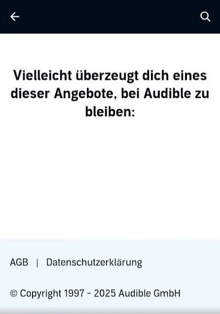
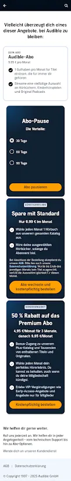

# Handling Inconsistent Offer Communication at Audible (Germany)

## **1. Context**

Audible attempts to retain users by presenting subscription renewal offers. During regular app use, I encountered two different versions of the same feature without any explanation.

For example, two messages had identical wording in German but were displayed with different layouts:

- **German (original):** „Dein Abo endet bald. Du bist kurz davor, alle deine Guthaben-Vorteile und den Zugriff auf Tausende im Abo enthaltene Titel zu verlieren.“
- **English (translation):** *“Your subscription is ending soon. You’re about to lose all your credit benefits and access to thousands of included titles.”*

In another instance, the message used slightly different wording:

- **German (original):** „Deine Mitgliedschaft endet bald. Verliere nicht deine Guthabenvorteile und den Zugriff auf Tausende von Titeln, die in deiner Mitgliedschaft enthalten sind.“
- **English (translation):** *“Your membership is ending soon. Don’t lose your credit benefits and access to thousands of titles included in your membership.”*

In addition, the app provides three different paths that lead to these subscription offers, which creates inconsistency in the overall user experience.

  
  

## **2. Observations**

- **Day 1**: I tapped on an offer. The headline said “Vielleicht überzeugt dich eines dieser Angebote, bei Audible zu bleiben:…” *(“Maybe one of these offers convinces you to stay with Audible:…”)* – but the page was completely empty.
- **Day 2**: I tapped on a similar offer and saw the same headline, this time followed by a long list of discounts and subscription options.
- Since then, I have only seen the “full” version again. This raises the question: Was the empty state caused by a system/server glitch, a device issue, or by design?

  

## **3. Problems**

- **Expectation gap**: The headline sets a promise, but sometimes delivers nothing.
- **Inconsistency**: Users face radically different outcomes (empty vs. overloaded).
- **Confusion**: Without explanation, users cannot know whether they did something wrong, whether the app failed, or whether no offers exist.
- **Trust issue**: Inconsistent states reduce credibility and leave users frustrated.

## **4. Potential Causes**

- Dynamic content loading without a proper fallback message.
- Possible device or connectivity issue not handled by the UI.
- Marketing copy written without considering error or empty states.
- Lack of testing beyond the “happy path.”

## **5. Proposed Rewrite of the Empty State**

**Deutsch:** 

„Im Moment gibt es keine speziellen Angebote für dich. Schau bald wieder vorbei oder entdecke jederzeit Tausende Titel im Katalog.” 

**English translation:**

*”At the moment, there are no special offers for you. Check back soon or explore thousands of titles in the catalog anytime.”*

## **6. Impact**

- Honest and transparent communication reduces confusion.
- Clear fallback messaging prevents users from blaming themselves for technical issues.
- Consistency across states builds trust and creates a reliable user experience.
- Alignment with Audible’s brand voice (e.g., using established phrases like “Tausende Titel”) ensures that rewrites feel natural, familiar, and credible to users.

## 7. Conclusion

This case study illustrates how inconsistent states, whether caused by system errors, device glitches, or incomplete content design, undermine user trust. When users encounter an empty page after a promising headline, they are left confused and may even blame themselves.

Effective UX writing must therefore anticipate not only the “happy path,” but also empty and error states. Clear fallback messages and consistent communication ensure that users always understand what happened and what to do next.
