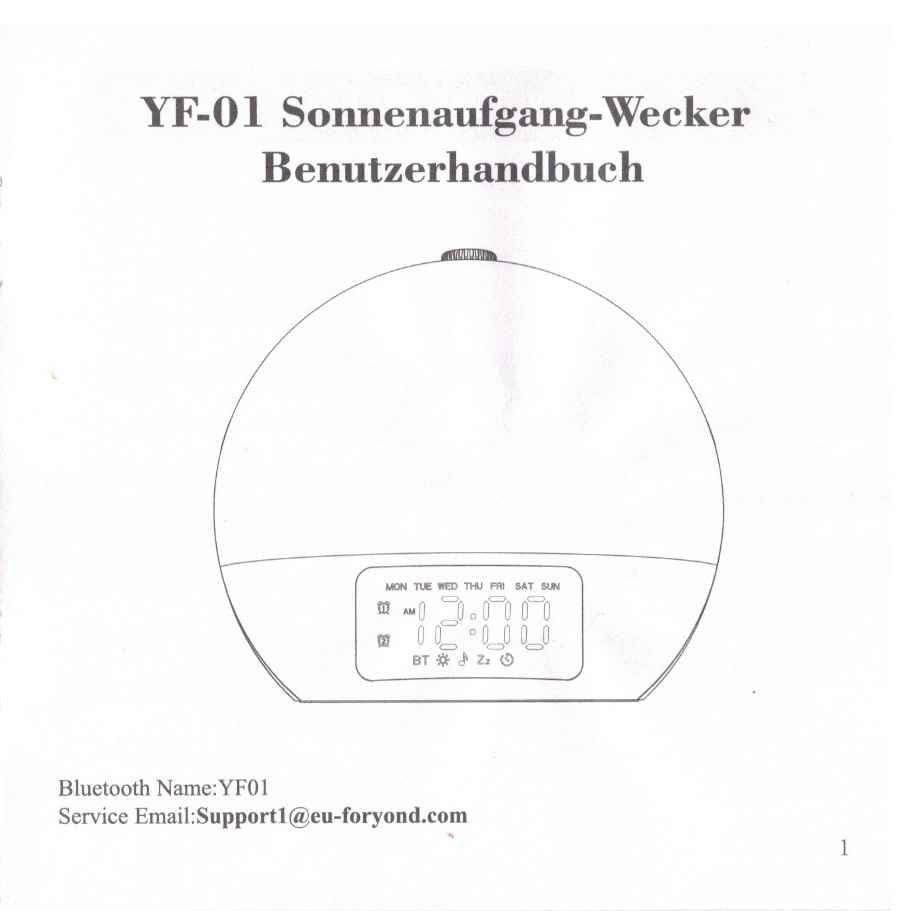
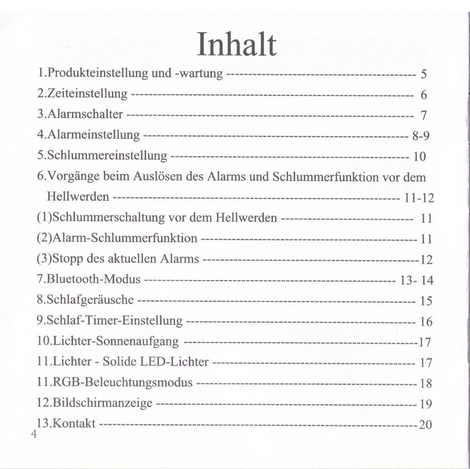

# Bedienungsanleitung Lichtwecker

## **tl;dr**
- Bedienungsanleitung für einen Lichtwecker (Consumer Device)
- Fokus: klare UI-Erläuterungen und verständliche Schritt-für-Schritt-Anweisungen
- Zweisprachiges Sample (DE/EN)

## 1. Kontext

Ich habe den Lichtwecker selbst gekauft. Schnell habe ich gemerkt: Die Anleitung ist schwer verständlich, unübersichtlich und sprachlich uneinheitlich. Sie richtet sich **nicht** an erwachsene Nutzer ohne Technikaffinität. Begriffe bleiben unklar, der Nutzungsfluss fehlt.

Als Technical Writer habe ich einige Schwächen exemplarisch analysiert und behoben.

Es handelt sich um diesen Wecker:  
https://www.amazon.de/dp/B0DCG3YP3T?ref_=ppx_hzsearch_conn_dt_b_fed_asin_title_1

## 2. Ziel

Mein Ziel ist es, Teile der Anleitung exemplarisch so umzugestalten, dass sie für erwachsene Nutzer ohne technische Vorkenntnisse verständlich, klar strukturiert und intuitiv nutzbar werden. Dabei liegt der Fokus auf einer logischen Gliederung, einheitlicher Terminologie und einer Sprache, die ohne Vorwissen auskommt, aber dennoch präzise erklärt und unterstützt.

## 3. Produktübersicht

### 3.1. Analyse der Produktübersicht

#### **Stärken**

- Übersichtliche Zeichnung mit klarer Nummerierung  
- Funktionsliste vollständig zugeordnet  
- Reihenfolge folgt der physischen Anordnung am Gerät

#### **Schwächen**

- **Sprachlich uneinheitlich:** Mischung aus technischen und werblichen Begriffen  
- **Sperrige Formulierungen:** z. B. „Lichthelligkeitssteuerungs-Rolle“  
- **Rechtschreibfehler:** z. B. „Alarm 1 Schalter“  
- **Fehler im Produktdesign:** Alarmtaste 2 liegt links vor Alarmtaste 1

### 3.2. Überarbeitete Produktübersicht

Die ursprüngliche Übersicht benennt alle Bedienelemente, ist jedoch sprachlich uneinheitlich und teils sperrig. In der überarbeiteten Version wurden Begriffe vereinfacht, Doppelfunktionen klarer benannt und eine funktionale, neutrale Sprache verwendet. Die Reihenfolge folgt weiterhin der physischen Anordnung des Geräts.

Der Fehler im Produktdesign lässt sich nicht beheben, die Tastenbezeichnungen bleiben daher unlogisch.

#### **Bedienelemente des Lichtweckers**

1. Alarm-2-Taste  
2. Alarm-1-Taste  
3. Helligkeitsregler  
4. Lichtmodus-Taste  
5. Lichteffekt-Taste  
6. Zeiteinstell- und Schlummer-Drehknopf  
7. Bluetooth- und Display-Taste  
8. Zeiteinstell- und Einschlaf-Taste  
9. Lautstärkeregler  
10. Schlafgeräusch-Taste  
11. Melodie- und Naturklang-Taste  
12. Anschluss für USB-A-Kabel  
13. Anschluss für USB-C-Kabel  
14. Lautsprecher

## 4. Inhaltsverzeichnis

### 4.1. Analyse des Inhaltsverzeichnisses

#### **Stärken**

- Nummerierung  
- Grundsätzlich logische Reihenfolge  
- Relevante Themen enthalten

#### **Schwächen**

- **Unklare oder doppelte Begriffe**
  - „Alarmschalter“ vs. „Alarmeinstellung“  
  - „Schlaf-Timer-Einstellung“ vs. „Schlafgeräusche“
- **Inkonsistente Terminologie**
  - „Bildschirmanzeige“ vs. „Display-Einstellungen“  
  - „RGB-Beleuchtungsmodus“ vs. „RGB-Licht“
- **Unklare Reihenfolge**
  - Bluetooth weiter oben sinnvoll  
  - „Kontakt“ → „Support & Kontakt“
- **Fehlende Rubriken**
  - Keine Fehlerbehebung  
  - Keine technischen Daten

### 4.2. Überarbeitetes Inhaltsverzeichnis

#### **Inhalt**

1. Produkteinstellung und -wartung  
2. Zeit- und Displayeinstellung  
3. Weckfunktionen und Schlummermodus  
4. Bluetooth-Modus  
5. Einschlaffunktionen  
6. Lichtfunktionen  
7. Fehlersuche und Problemlösung  
8. Technische Daten  
9. Support und Kontakt

## 5. Produkteinstellung und -wartung

### 5.1. Analyse des Abschnitts „Produkteinstellung und -wartung“

#### **Stärken**

- Themen Stromversorgung, Lagerung, Reinigung abgedeckt  
- Logische Reihenfolge  
- Kompakte Absätze, gute Lesbarkeit

#### **Schwächen**

- **Begrifflich falsch:** „Batterie“ statt „Akku“  
- **Unklare Formulierungen** („AC-Stromverbindung“)  
- **Fehlende Informationen:** Akkulaufzeit, Lagerbedingungen, sichere Reinigungsmaterialien

### 5.2. Überarbeiteter Abschnitt „Produkteinstellung und -wartung“

#### **Produkteinstellung und Wartung**

Wenn Sie das Produkt erstmalig verwenden, verbinden Sie das mitgelieferte USB-Kabel zuerst mit dem USB-C-Anschluss des Weckers und anschließend mit einem Netzadapter.

Der Wecker benötigt eine konstante Stromverbindung.

1. **Akku-Inbetriebnahme**  
   Der Wecker hat einen vorab installierten Akku. Entfernen Sie vor Gebrauch den Isolieraufkleber. Der Akku sichert Ihre Einstellungen bei Stromausfall.

2. **Produktlagerung**  
   Lagern Sie den Wecker an einem kühlen, trockenen Ort. Vermeiden Sie direktes Sonnenlicht und Feuchtigkeit.

3. **Produktreinigung**  
   Entfernen Sie Staub mit einem weichen, leicht feuchten Tuch. Verwenden Sie keine flüssigen oder scheuernden Reinigungsmittel.

## 6. Fazit

Diese exemplarische Überarbeitung zeigt, wie sich technische Inhalte durch klare Sprache, logische Gliederung und nutzerorientiertes Denken verbessern lassen. Auch ohne vollständige Neugestaltung wird die Nutzung für technisch weniger affine Zielgruppen erleichtert. Eine vollständige Anleitung müsste entsprechend angepasst werden.

Diese Kombination aus Analyse, Strukturarbeit und sprachlicher Vereinfachung bildet den Kern meiner Arbeitsweise als Technical Writer.
